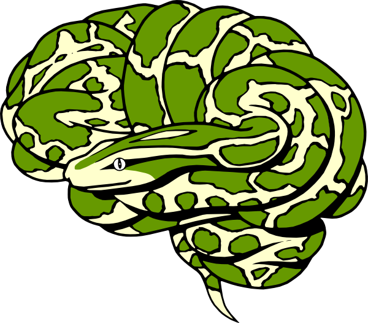
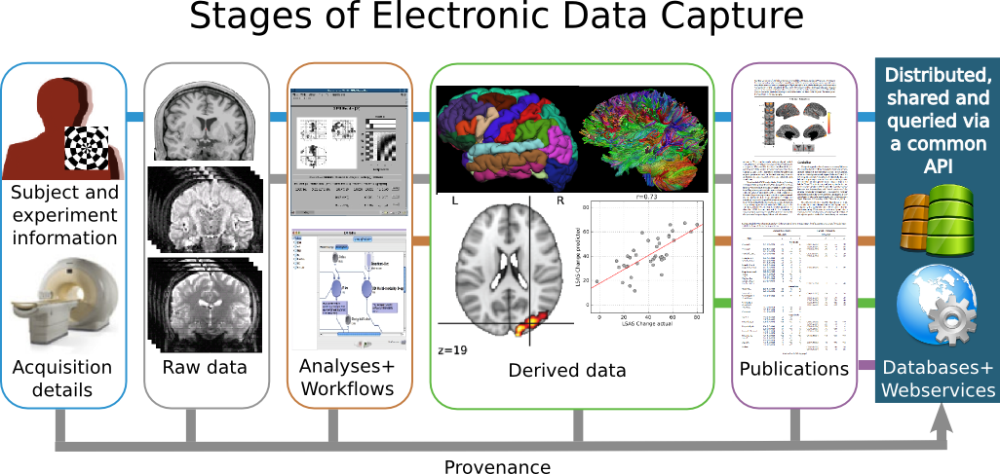
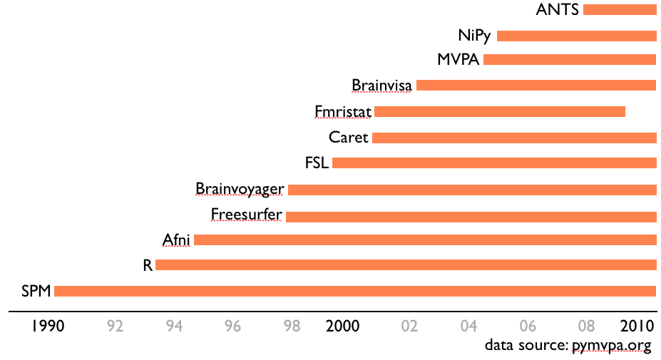

.. raw:: html

  
  

.. raw:: html

   <b style="font-size:48px;">
   <a href="http://nipy.org/nipype" style="text-decoration:none;border-bottom:0px;">
   {'Nipype': ('why', 'what', 'how')}
   </a></b>

satra@mit.edu

`CREDITS <https://github.com/nipy/nipype/blob/master/THANKS>`_

.. raw:: html

  

  

----

What we will cover today
------------------------

- overview of Nipype
- semantics of Nipype
- playing with interfaces
- creating workflows
- writing functions

----

Why Nipype?
-----------

----

... one ring to bind them ...
-----------------------------

----

Brain imaging: the process
~~~~~~~~~~~~~~~~~~~~~~~~~~

From design to databases [1]_

----

Brainimaging software
~~~~~~~~~~~~~~~~~~~~~

a plethora of evolving options

----

Brainimaging software: issues
~~~~~~~~~~~~~~~~~~~~~~~~~~~~~

- different algorithms
- different assumptions
- different platforms
- different interfaces
- different file formats

----

Leads to many questions?
~~~~~~~~~~~~~~~~~~~~~~~~

neuroscientist:

    - which packages should I use?
    - why should I use these packages?
    - how do they differ?
    - how should I use these packages?

developer:

    - which package(s) should I develop for?
    - how do I disseminate my software?

----

... and issues
~~~~~~~~~~~~~~

- Installing, using, maintaining and testing multiple packages
- Reducing manual intervention
- Training people
- Tailoring to specific projects
- Developing new tools
- Reproducing results

----

Many workflow systems out there
~~~~~~~~~~~~~~~~~~~~~~~~~~~~~~~

- `BioImage Suite <http://www.bioimagesuite.org/>`_
- `BIRN Tools <https://wiki.birncommunity.org/x/LgFrAQ>`_
- `BrainVisa <http://brainvisa.info/>`_
- `CambaFX <http://www-bmu.psychiatry.cam.ac.uk/software/>`_
- `JIST for MIPAV <http://www.nitrc.org/projects/jist/>`_
- `LONI pipeline <http://pipeline.loni.ucla.edu>`_
- `MEVIS Lab <http://www.mevislab.de/>`_
- `PSOM <http://code.google.com/p/psom/>`_

----

Solution requirements
~~~~~~~~~~~~~~~~~~~~~

Coming at it from a developer's perspective, we needed something

- lightweight
- provided formal, common semantics
- allowed interactive exploration
- supported efficient batch processing
- enabled rapid algorithm prototyping
- was flexible and adaptive

----

Existing technologies
~~~~~~~~~~~~~~~~~~~~~

**shell scripting**:

  Can be quick to do, and powerful, but application specific scalability, and
  not easy to port across different architectures.

**make/CMake**:

  Similar in concept to workflow execution in Nipype, but again limited by the
  need for command line tools and flexibility in terms of scaling across
  hardware architectures (although see `makeflow <http://nd.edu/~ccl/software/makeflow/>`_).

**Octave/MATLAB**:

  Integration with other tools is *ad hoc* (i.e., system call) and dataflow is
  managed at a programmatic level. However, see PSOM_ which offers a very nice
  alternative to some aspects of Nipype for Octave/Matlab users.

**Graphical options**: (e.g., `LONI pipeline`_)

  Adding or reusing components across different projects require XML
  manipulation or subscribing to some specific databases.

----

We built Nipype in Python
-------------------------

----

Why Python?
-----------

* easy to program and document
* cross-platform
* extensive infrastructure for

 - development and distribution
 - scientific computing
 - brain imaging

----

What can we use Python for?
~~~~~~~~~~~~~~~~~~~~~~~~~~~

* scripting (like shell scripts e.g. bash, csh)
* make web sites (like these slides)
* **science** (like R, Matlab, IDL, Octave, Scilab)
* etc.

You just need to know 1 language to do almost everything !

----

Scientific Python building blocks
~~~~~~~~~~~~~~~~~~~~~~~~~~~~~~~~~

* **IPython**, an advanced **Python shell**: http://ipython.org
* **Numpy** : provides powerful **numerical arrays** objects, and routines to
  manipulate them: http://www.numpy.org
* **Scipy** : high-level data processing routines.
  Optimization, regression, interpolation, etc: http://www.scipy.org
* **Matplotlib** a.k.a. Pylab: 2-D visualization, "publication-ready" plots
  http://matplotlib.sourceforge.net
* **Mayavi** : 3-D visualization
  http://code.enthought.com/projects/mayavi
* **Scikit-learn**, machine learning: http://scikit-learn.org
* **Scikit-Image**, image processing: http://scikits-image.org
* **RPy2**, communicating with R: http://rpy.sourceforge.net/rpy2.html

----

Brain Imaging in Python
~~~~~~~~~~~~~~~~~~~~~~~

* **NiPy**, an umbrella project for Neuroimaging in Python: http://nipy.org

  - **DiPy**, diffusion imaging
  - **Nibabel**, file reading and writing
  - **NiPy**, preprocessing and statistical routines
  - **Nipype**, interfaces and workflows
  - **Nitime**, time series analysis
  - **PySurfer**, Surface visualization
* **PyMVPA**, machine learning for neuroimaging: http://pymvpa.org
* **PsychoPy**, stimulus presentation: http://psychopy.org

----

What is Nipype?
---------------

----

Nipype architecture
~~~~~~~~~~~~~~~~~~~

* Interface
* Engine
* Executable Plugins

.. image:: images/arch.png
   :scale: 60%

----

Semantics
~~~~~~~~~

* **Interface**: Wraps a program or function
* Engine

    - **Node/MapNode**: Wraps an `Interface` for use in a Workflow that provides
      caching and other goodies (e.g., pseudo-sandbox)
    - **Workflow**: A *graph* or *forest of graphs* whose nodes are of type `Node`,
      `MapNode` or `Workflow` and whose edges represent data flow
* **Plugin**: A component that describes how a `Workflow` should be executed

----

Software interfaces
~~~~~~~~~~~~~~~~~~~

Currently supported (4-2-2012). `Click here for latest <http://www.mit.edu/~satra/nipype-nightly/documentation.html>`_

.. list-table::

  * - `AFNI <http://afni.nimh.nih.gov/afni>`_
    - `ANTS <http://www.picsl.upenn.edu/ANTS/>`_
  * - `BRAINS <http://www.psychiatry.uiowa.edu/mhcrc/IPLpages/BRAINS.htm>`_
    - `Camino <http://www.cs.ucl.ac.uk/research/medic/camino>`_
  * - `Camino-TrackVis <http://www.nitrc.org/projects/camino-trackvis>`_
    - `ConnectomeViewerToolkit <http://www.connectomeviewer.org>`_
  * - `dcm2nii <http://www.cabiatl.com/mricro/mricron/dcm2nii.html>`_
    - `Diffusion Toolkit <http://www.trackvis.org/dtk>`_
  * - `FreeSurfer <http://freesurfer.net>`_
    - `FSL <http://www.fmrib.ox.ac.uk/fsl>`_
  * - `MRtrx <http://www.brain.org.au/software/mrtrix/index.html>`_
    - `Nipy <http://nipy.org/nipy>`_
  * - `Nitime <http://nipy.org/nitime>`_
    - `PyXNAT <http://github.com/pyxnat>`_
  * - `Slicer <http://www.slicer.org>`_
    - `SPM <http://www.fil.ion.ucl.ac.uk/spm>`_

.. attention:: Most used/contributed policy!

   Not every component of these packages are available.

----

Workflows
~~~~~~~~~

.. list-table::

  *  - Properties:

       - processing pipeline is a directed acyclic graph (DAG)
       - nodes are processes
       - edges represent data flow
       - compact represenation for any process
       - code and data separation

     - .. image:: images/workflow.png

----

Execution Plugins
~~~~~~~~~~~~~~~~~

* allows seamless execution across many architectures

  - local

    - serially
    - multicore

  - Clusters

    - Condor
    - PBS/Torque
    - SGE
    - SSH (via IPython)

----

How can I use Nipype?
---------------------

- Environment and installing

- Nipype as a brain imaging library

- Building and executing workflows

- Contributing to Nipype

Presenter Notes
~~~~~~~~~~~~~~~

- imperative style caching
- Workflow concepts
- Hello World! of workflows
- Grabbing and Sinking
- iterables and iterfields
- Distributed computing
- The `Function` interface
- Config options
- Debugging
- actual workflows (resting, task, diffusion)

----

Installing and environment
~~~~~~~~~~~~~~~~~~~~~~~~~~

Scientific Python:

* Debian/Ubuntu/Scientific Fedora
* Enthought Python Distribution (`EPD <http://www.enthought.com/products/epd.php>`_)

Installing Nipype:

* Available from `@NeuroDebian <http://neuro.debian.net/pkgs/python-nipype.html>`_,
  `@PyPI <http://pypi.python.org/pypi/nipype/>`_, and
  `@GitHub <http://github.com/nipy/nipype>`_

* Dependencies: networkx, nibabel, numpy, scipy, traits

Running Nipype (`Quickstart <http://nipy.org/nipype/quickstart.html>`_):

* Ensure tools are installed and accessible
* Nipype is a wrapper, not a substitute for AFNI, ANTS, FreeSurfer, FSL, SPM,
  NiPy, etc.,.

----

For today's tutorial
~~~~~~~~~~~~~~~~~~~~

when you type:

    .. sourcecode:: bash

        $ module add nipype-tutorial
        $ cd $TUTORIAL_DIR
        $ ipython notebook --pylab=inline

it does the following:

    .. sourcecode:: bash

        source /software/python/EPD/virtualenvs/7.2/nipype0.5/bin/activate
        export TUTORIAL_DIR=/mindhive/scratch/$LOGIN/nipype-tutorial
        mkdir -p $TUTORIAL_DIR
        cd $TUTORIAL_DIR
        ln -s /mindhive/xnat/data/nki_test_retest nki
        ln -s /mindhive/xnat/data/openfmri/ds107 ds107
        ln -s /mindhive/xnat/surfaces/tutorial surfaces
        module add torque

----

Tutorial data
~~~~~~~~~~~~~

* `OpenfMRI test-retest data <http://openfmri.org/dataset/ds000107>`_

    - subj id1
    - subj id2

* `NKI Test-Retest data <http://fcon_1000.projects.nitrc.org/indi/pro/eNKI_RS_TRT/FrontPage.html>`_

    - subj id1
    - subj id2

----

Nipype as a brain imaging library
~~~~~~~~~~~~~~~~~~~~~~~~~~~~~~~~~

.. sourcecode:: python

   >>> from nipype.interfaces.camino import DTIFit
   >>> from nipype.interfaces.spm import Realign

.. sourcecode:: python

   >>> DTIFit.help()
   >>> Realign.help()

.. sourcecode:: python

    >>> fitter = DTIFit(scheme_file='A.sch',
                        in_file='data.bfloat')
    >>> fitter.run()

    >>> aligner = Realign(in_file='A.nii')
    >>> aligner.run()

----

Hello world!
--------------------------------------------------------------------------------

----

References
----------

.. [1] Poline J, Breeze JL, Ghosh SS, Gorgolewski K, Halchenko YO, Hanke M,
  Helmer KG, Marcus DS, Poldrack RA, Schwartz Y, Ashburner J and Kennedy DN
  (2012). Data sharing in neuroimaging research. Front. Neuroinform. 6:9.
  http://dx.doi.org/10.3389/fninf.2012.00009
